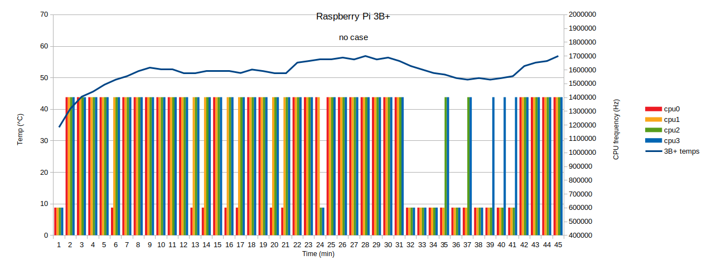
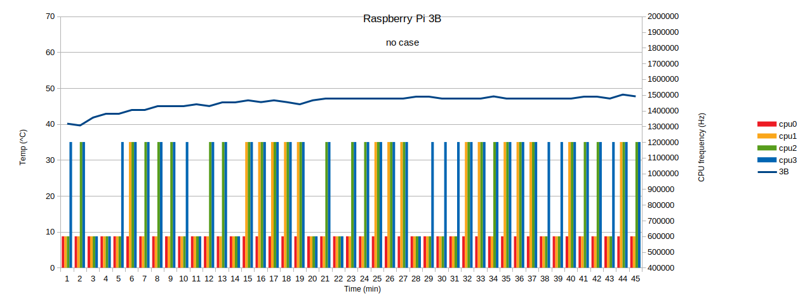

This is temperature monitor script for Raspberry Pi.
When you execute the script, it will ask you for how long do you want to map temperatures (in minutes).
After that, you will have complete file (in ~/ directory), named "temps.csv" with temperature data and all 4 cpu cores frequencies mapped in 1 min intervals. This way you can track cpu throttling at certain temperatures.
You can easily import that in libre office calc and plot awesome diagrams.

Note: do not close terminal session which is running the script, otherwise the test will close.

If you want to run the script from anywhere in the system: 
sudo ln -s /home/pi/Raspberry-Pi-random/Temp_monitor/temp_track.sh /usr/bin/temp_monitor

Some of data: 

